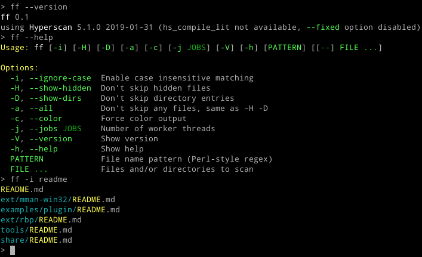

Find File (ff)
==============

A find-like tool using Hyperscan for regex matching.

Inspired by [fd](https://github.com/sharkdp/fd).

Implementation:
- fast file tree walk using `fdopendir(3)`, `openat(2)`
- custom threadpool with simple locking queue
- no sorting, no `stat(2)` (dirs are detected using `O_DIRECTORY`)

Possible future features:
- sorting would be nice, sometimes :-)
- option to `stat(2)` each found file and show some details, e.g. file size
- interpretation of `.gitignore` (but this would add a ton of complexity)

